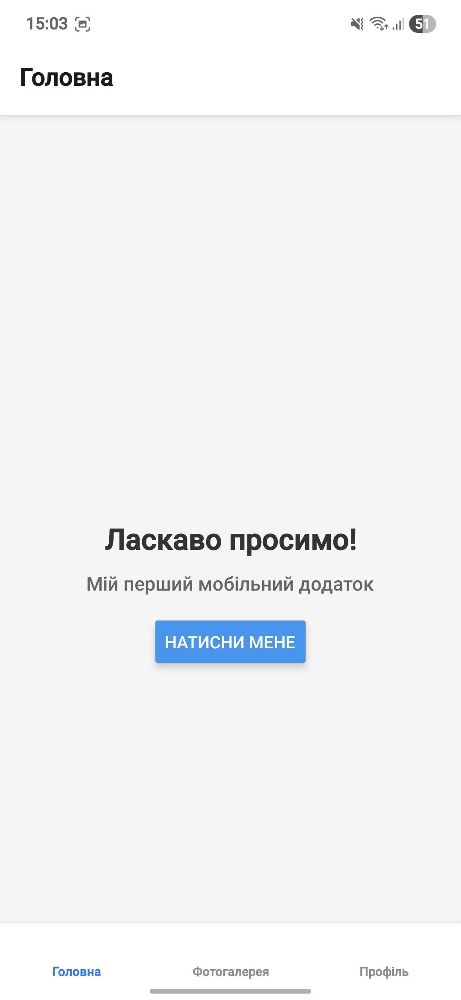
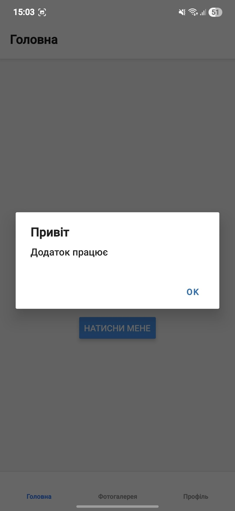
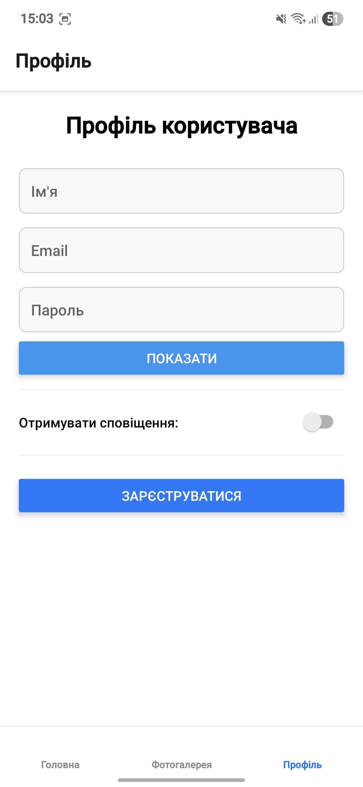
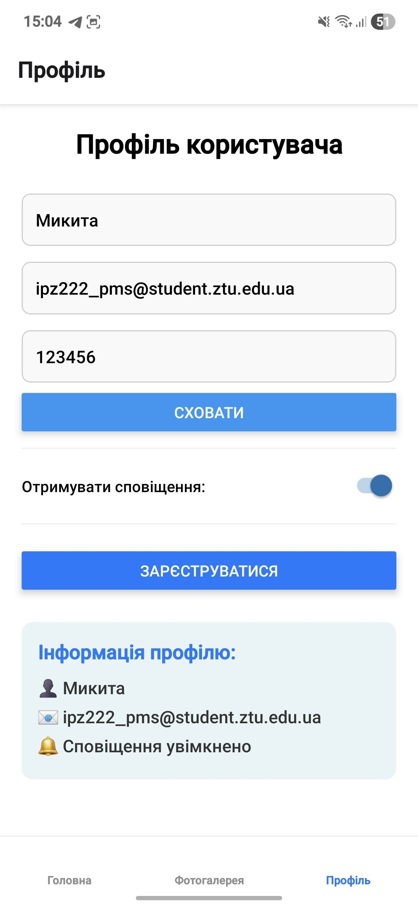
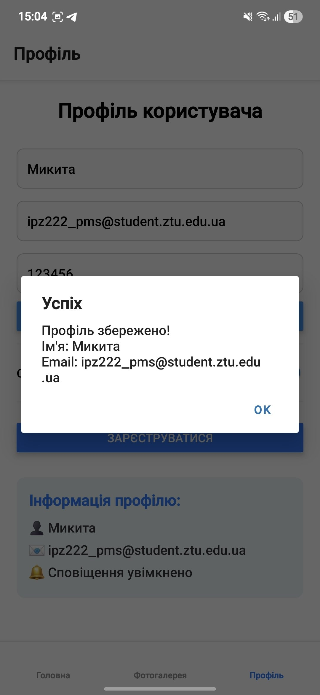

# Лабораторні роботи з дисципліни "Розробка мобільних додатків"
## Студент: Платонов Микита Сергійович (ІПЗ-22-2)

### Лабораторна робота №1
Тема: Використання Expo для створення найпростішого додатку React Native
**Мета:** Навчитися створювати та налаштовувати проєкт у середовищі Expo, ознайомитися зі структурою React Native застосунку та опанувати навички роботи з базовими компонентами.

## Про додаток

Мій перший мобільний додаток на React Native з використанням Expo. Додаток містить три екрани:

- **Головна** - вітальний екран з кнопкою
- **Фотогалерея** - галерея зображень
- **Профіль** - форма для введення даних користувача (ім'я, email, пароль)

### Спосіб запуску через Expo Go
1. Встановіть додаток Expo Go на телефон
2. Клонуйте репозиторій: `git clone [URL]`
3. Перейдіть в папку lab1: `cd lab1`
4. Встановіть залежності: `npm install`
5. Запустіть: `npx expo start --tunnel`
6. Відскануйте QR-код додатком Expo Go

### Вимоги:
- Node.js (версія 18 або вище)
- npm (версія 9 або вище)
- Телефон з додатком **Expo Go** (Google Play або App Store)

### Інструкція:

1. **Клонуйте репозиторій:**
   ```bash
   git clone https://github.com/MykytaPlatonov/MobileLabsRN2026.git
   cd MobileLabsRN2026/lab1

### Скріншоти







### Основні способи запуску мобільних додатків:
1. **Expo Go** - найпростіший, не потребує встановлення SDK, для швидкого тестування
2. **Android Emulator** - потребує Android Studio, для тестування на різних версіях Android
3. **Фізичний пристрій** - найточніше тестування, потребує налаштування USB Debugging