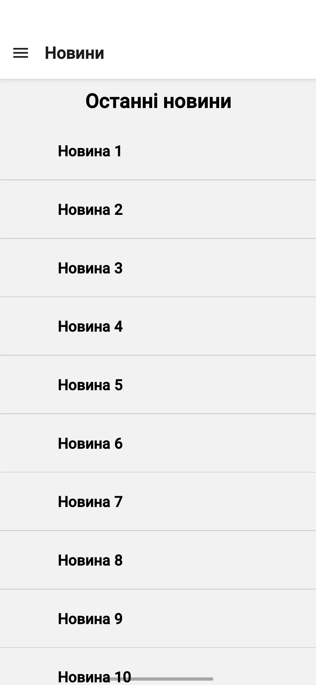
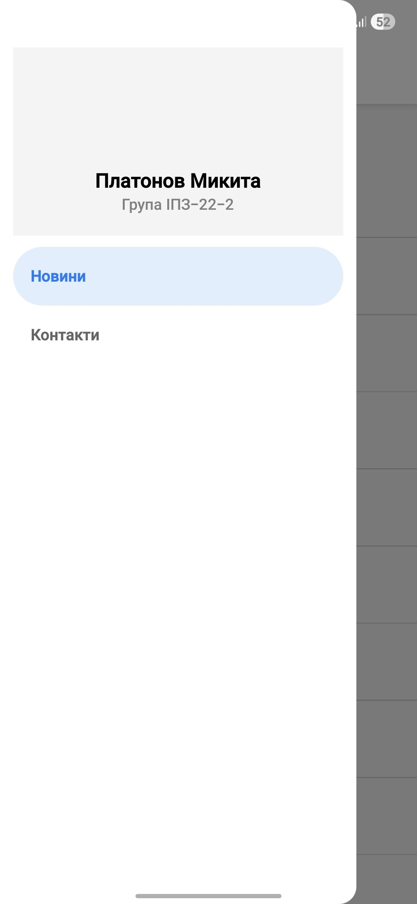

# Лабораторна робота №2: Навігація та списки в React Native

## Виконав
**Студент:** Платонов Микита
**Група:** ІПЗ-22-2

---

## Інструкція запуску
1. Клонуйте репозиторій.
2. Перейдіть у папку з проєктом:
cd lab2
Встановіть необхідні залежності:
npm install
Запустіть сервер Expo:
npx expo start -c
Відскануйте QR-код за допомогою застосунку Expo Go.

Опис реалізованого функціоналу
1. Навігаційна структура
Drawer Navigator: Основне меню застосунку.

Stack Navigator: Вкладений у Drawer для переходу між списком новин (MainScreen) та детальною інформацією (DetailsScreen).

Кастомне меню: Реалізовано CustomDrawerContent з відображенням ПІБ та групи студента.

2. Екран новин (FlatList)
Модель даних: Об'єкти містять id, title, description та image.

Pull-to-Refresh: Оновлення списку за допомогою жесту зверху вниз (onRefresh).

Infinite Scroll: Автоматичне підвантаження даних при досягненні кінця списку.

Компоненти: Додано стилізований заголовок (ListHeader), футер з індикатором завантаження (ListFooter) та розділювачі між елементами.

Оптимізація: Налаштовано параметри initialNumToRender, maxToRenderPerBatch та windowSize.

3. Екран контактів (SectionList)
Дані розбиті на секції: "Викладачі" та "Студенти".

Реалізовано рендеринг заголовків секцій та кастомних розділювачів.

## Скріншоти роботи застосунку

## Висновки (Контрольні запитання)
Які основні типи навігації існують у React Navigation? Найпоширенішими є Stack (лінійна навігація), Tab (нижнє або верхнє меню), та Drawer (бічне висувне меню). У цій роботі було використано поєднання Drawer та Stack.

Яка різниця між FlatList та SectionList? FlatList ідеально підходить для однорідних лінійних списків, тоді як SectionList призначений для логічного групування даних у секції з власними заголовками.

Як реалізувати передачу параметрів між екранами? Параметри передаються через другий аргумент функції navigation.navigate('ScreenName', { data }), а отримуються на цільовому екрані через об'єкт route.params.

Для чого використовується GestureHandlerRootView? Цей компонент необхідний для коректної роботи жестів (свайпів, натискань) у бібліотеках на кшталт react-native-gesture-handler, особливо при використанні Drawer-навігації на Android.

Які методи оптимізації списків є найефективнішими? Використання memo для елементів списку, правильне налаштування windowSize (обмеження кількості рендерених елементів поза екраном) та використання keyExtractor для ідентифікації елементів без перерендерингу всього списку.