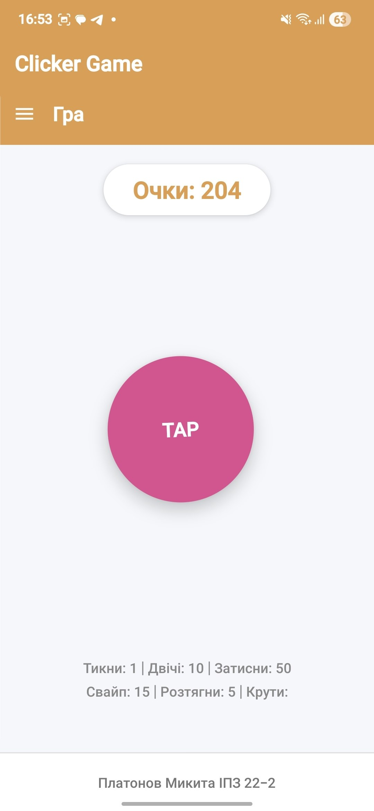
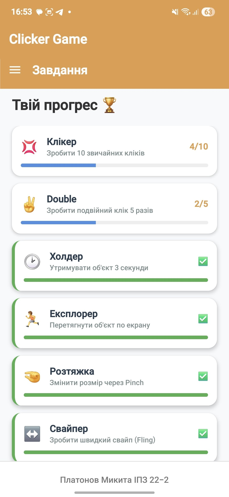
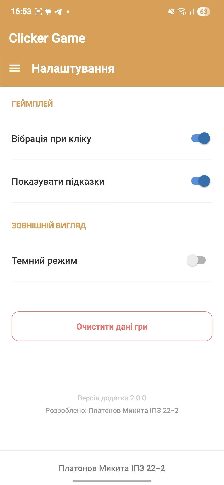

# Clicker Game (Лабораторна робота №3)

Мобільний застосунок "Гра-клікер", розроблений на React Native (Expo). Проєкт демонструє використання кастомних жестів, стилізації інтерфейсу, анімацій та глобального управління станом.

## Технології та бібліотеки
- **React Native / Expo** — основа застосунку.
- **react-native-gesture-handler** — для обробки складних жестів.
- **react-native-reanimated** — для створення плавних анімацій (масштабування, обертання тощо).
- **React Context API** — для глобального управління станом гри та синхронізації даних між екранами.
- **React Navigation (Drawer)** — для створення бічного меню навігації.

## Інструкція запуску

1. Склонуйте репозиторій або завантажте архів з проєктом:
   ```bash
   git clone <посилання_на_репозиторій>
Перейдіть до папки проєкту:
cd lab3

Встановіть необхідні залежності:
npm install

Запустіть проєкт:
npx expo start

Відскануйте QR-код через додаток Expo Go на вашому смартфоні (або запустіть на емуляторі).

Опис реалізованого функціоналу
1. Головний екран (Гра)
Основний ігровий простір з інтерактивним об'єктом та лічильником балів.
Реалізовано всі 6 обов'язкових жестів з методички та 1 власний:

Tap (коротке натискання) — додає 1 очко.

Double Tap (подвійний клік) — додає 10 очок.

Long Press (утримання) — додає 50 очок.

Pan (перетягування) — вільне переміщення об'єкта по екрану.

Pinch (масштабування) — розтягування об'єкта дає 5 очок.

Fling (свайп вліво/вправо) — швидкий змах додає 15 очок.

🌪️ Rotation (ВЛАСНЕ ЗАВДАННЯ) — скручування об'єкта двома пальцями обертає його та дає 20 бонусних очок.

Жести налаштовані так, щоб не блокувати один одного (використано Gesture.Simultaneous та Gesture.Exclusive).

2. Екран завдань (Ачівки)
Список ігрових завдань, які користувач має виконати.

Прогрес кожного завдання оновлюється в реальному часі (завдяки GameContext).

Використовується динамічна шкала прогресу (progress bar).

При досягненні мети завдання підсвічується зеленим кольором із позначкою "✅".

3. Екран налаштувань
Візуальні перемикачі налаштувань.

Робоча кнопка "Очистити дані гри": викликає діалогове вікно підтвердження (Alert) та повністю скидає всі набрані очки й прогрес завдань через глобальний стан.

Структура проєкту
/App.js — головний файл, налаштування навігації (Drawer).

/GameContext.js — глобальний стан (зберігає очки та статистику дій).

/screens/GameScreen.js — логіка жестів, анімації та нарахування очок.

/screens/TasksScreen.js — відображення списку завдань та прогресу.

/screens/SettingsScreen.js — меню налаштувань та логіка скидання прогресу.

## Скріншоти


