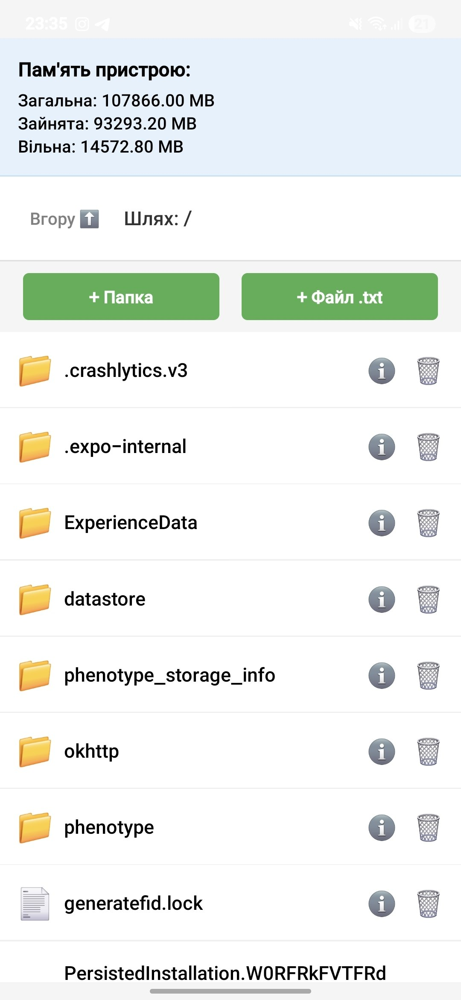
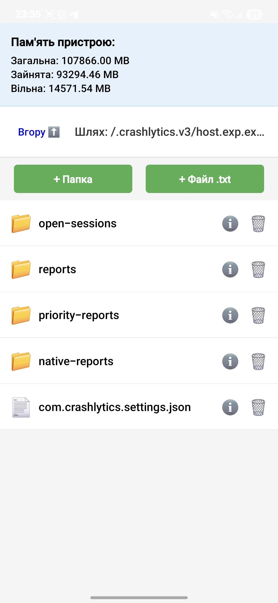
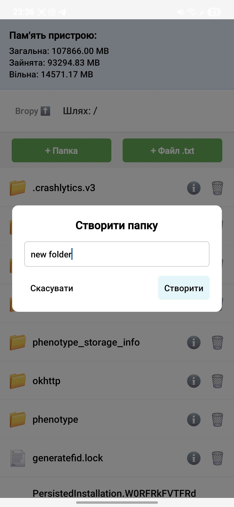
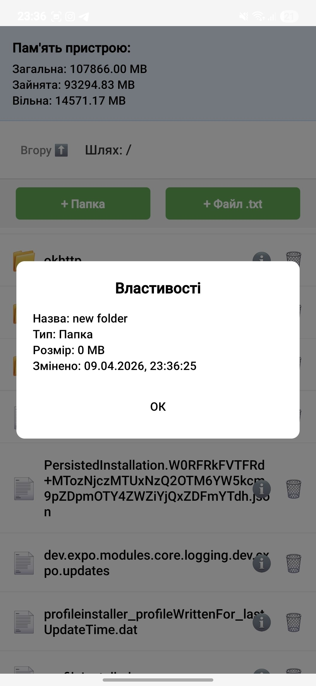
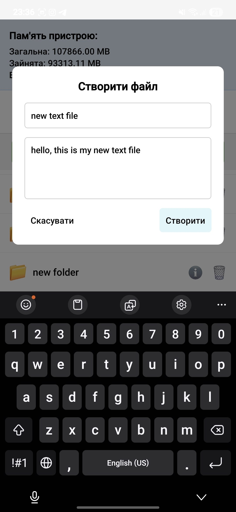
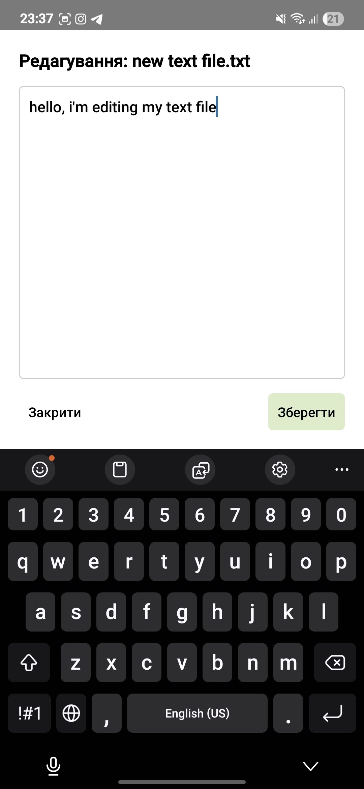
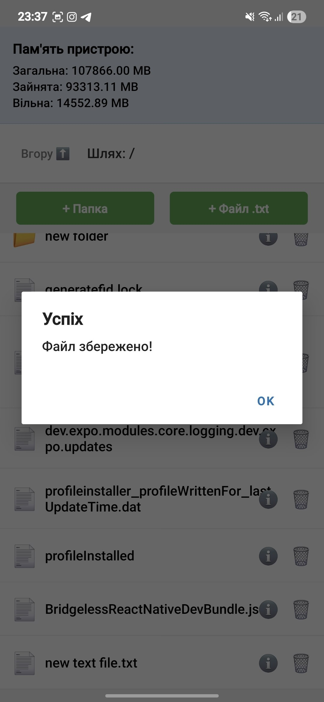
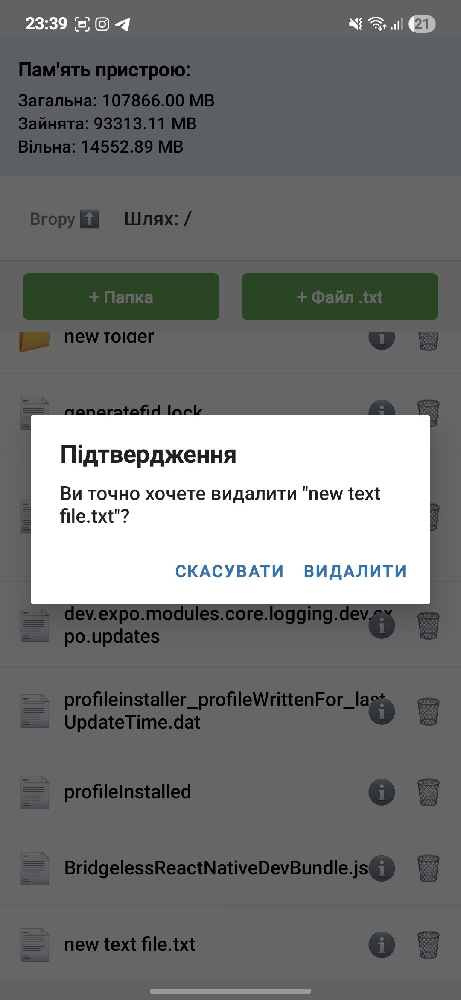
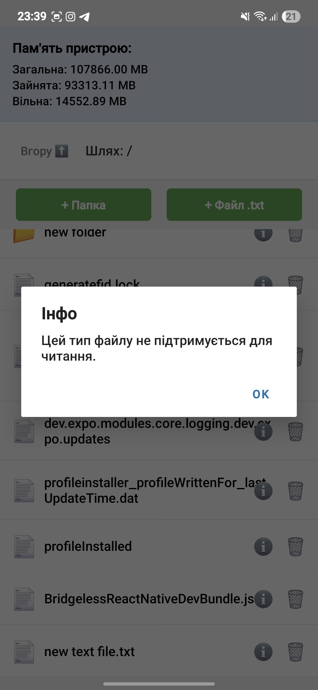

# Файловий менеджер (Лабораторна робота №4)

Цей мобільний застосунок розроблено за допомогою React Native та Expo. Він дозволяє керувати локальною файловою системою мобільного пристрою (у межах пісочниці застосунку), використовуючи бібліотеку `expo-file-system`.

## Опис реалізованого функціоналу

У застосунку реалізовано всі вимоги згідно з лабораторною роботою:

1. **Навігація:**
   - Відображення поточного шляху.
   - Перегляд списку файлів і папок у поточній директорії.
   - Перехід у вкладені папки та повернення назад (кнопка "Вгору").
2. **Створення:**
   - Створення нових папок.
   - Створення нових текстових файлів `.txt` із можливістю відразу задати початковий вміст.
3. **Зчитування та Редагування:**
   - Відкриття `.txt` файлів для читання та редагування у спеціальному модальному вікні.
   - Збереження внесених змін.
4. **Видалення:**
   - Видалення обраного файлу або папки.
   - Відображення вікна підтвердження (Alert) перед остаточним видаленням, щоб уникнути випадкових дій.
5. **Детальна інформація:**
   - Перегляд атрибутів об'єкта (назва, тип, розмір у мегабайтах, дата та час останньої зміни).
6. **Статистика пам'яті:**
   - На головному екрані відображається інформація про загальний обсяг пам'яті пристрою, обсяг зайнятого та вільного простору.

## Інструкція запуску

Для запуску проєкту на вашому комп'ютері повинен бути встановлений **Node.js**, а на мобільному телефоні — застосунок **Expo Go**.

1. Клонуйте репозиторій або завантажте папку з проєктом.
2. Відкрийте термінал у папці проєкту та встановіть усі необхідні залежності:
   npm install
   (Також переконайтеся, що встановлено react-native-safe-area-context для коректного відображення на сучасних пристроях).
3. Запустіть локальний сервер Expo з очищенням кешу (рекомендується для правильної роботи файлової системи):
npx expo start -c
4. Відскануйте згенерований QR-код за допомогою камери телефону (для iOS) або застосунку Expo Go (для Android).

## Скріншоти

